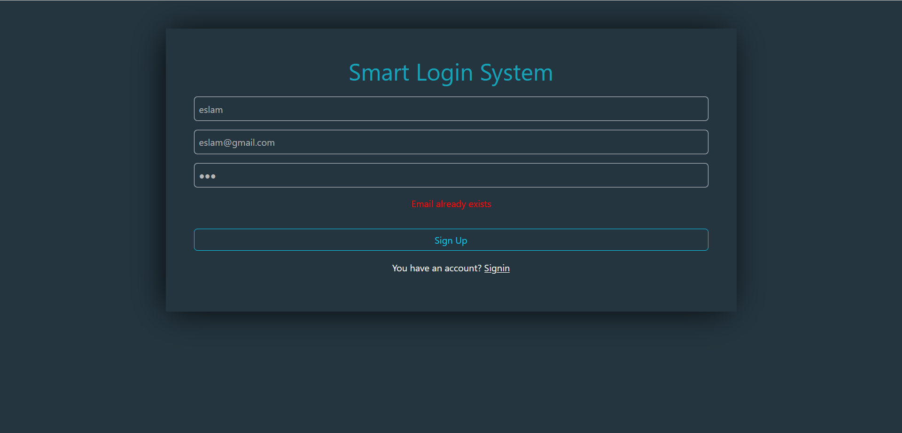

# User Registration and Login System

This project is a simple web application that allows users to **sign up** and **log in** using **localStorage** to store user data.

---

## 🛠️ **Features:**
1. **Sign Up:**
   - Users can register by entering their name, email, and password.
   - Data validation includes:
     - The name must have at least **3 characters**.
     - The email must be a **Gmail** address (e.g., user@gmail.com).
     - The password cannot be empty.
   - User data is stored in **localStorage**.

2. **Sign In:**
   - Users can log in by entering their registered email and password.
   - The email and password are validated against data stored in **localStorage**.
   - If the credentials are correct, a welcome message is displayed.

3. **Log Out:**
   - Allows users to log out and redirects them to the login page.

4. **Form Reset:**
   - Clears the input fields after each operation (sign up or sign in).

---

## ⚙️ **Technologies Used:**
- **HTML**: For the basic structure of the application.
- **CSS**: For styling the user interface.
- **JavaScript**: To implement the functionality and interactivity.
- **localStorage**: To persist and retrieve user data.

---

## 📂 **Project Files:**
- **index.html**: Contains the user interface.
- **style.css**: Provides styling for the application.
- **script.js**: Implements the core functionality.

---

## 📖 **Code Explanation:**

### 1. **Data Validation During Sign Up:**
- **Name**: Must have at least 3 characters and consist of letters only.
- **Email**: Must follow the Gmail format.
- **Password**: Cannot be empty.

### 2. **Sign Up Process:**
- Validates the entered data.
- If the email already exists, an error message is displayed.
- If the email is new, the user is added to **localStorage**.

### 3. **Sign In Process:**
- Checks that the entered email and password match registered data.
- Displays a welcome message if the credentials are correct.
- Shows an error message if the credentials are incorrect.

---

## 📋 **Potential Improvements:**
- Enhance password validation to check for strength (e.g., length, special characters).
- Support additional email domains (e.g., Yahoo, Outlook).
- Use libraries like **React** or **Tailwind CSS** for a more interactive and modern UI.

