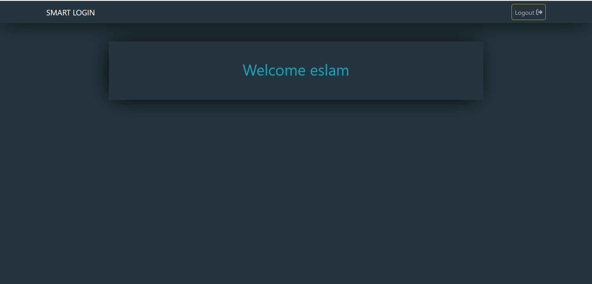

# Smart Login System 

## Welcome! 👋

Thanks for checking out this front-end coding.

## Project description.

**This project is a bookmarks management application where users can add site name and link, validate entries, and save them locally using localStorage. The user can also visit or delete links.**

### Expected behaviour

- Verify the validity of the site name. The name must contain more than 3 characters.
- A notification is displayed in green if the name is correct, or red if it is incorrect.
- If the input is incorrect, an error message is displayed with the field highlighted in red.

### How to use
- Enter the name of the website in its field.
- Enter the website link in its field
- If the input is correct, click the Add button to add it to the table and save it in localStorage
- You can visit the link directly by clicking the "Visit" button.
- To delete a specific site, press the "Delete" button.

### Code structure
- HTML: Contains text fields, buttons, and a table form.
- CSS: To improve the design and show correct and incorrect tags.
- JavaScript: To perform the following functions:
  1- Verify that the site name is at least 3 characters long.
  2- Validate the URL using a regular expression (RegEx).
  3- Add data: Store data in localStorage and add it to the table.
     Display Data: Fetch the stored data and display it in the table.
     Delete data: Delete a specific row from the table and from localStorage.
  4- Reset fields: clear entries and hide alert messages.
- Mobile-first

